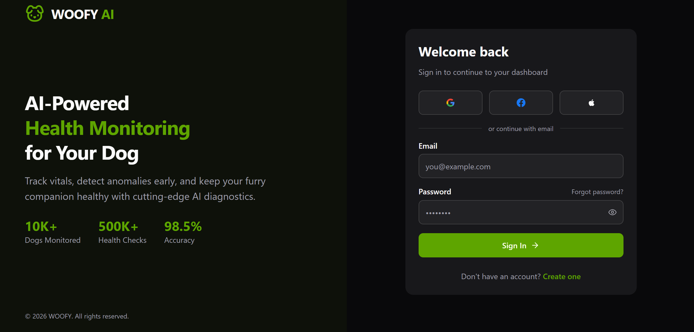
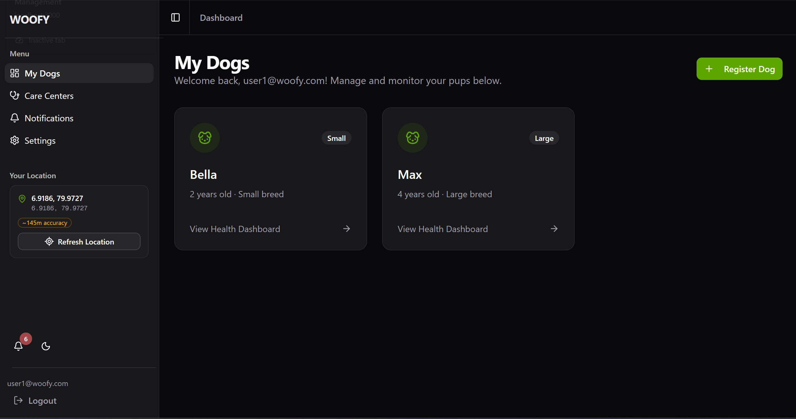

<p align="center">
  
  
  
  
  
  
</p>

<h1 align="center">🐾 WOOFY — VetBuddy AI</h1>
<h3 align="center">AI-Powered Canine Health Monitoring & Management System</h3>

<p align="center">
  <em>Real-time IoT vitals tracking · AI anomaly detection · Smart clinic finder · Emergency response system</em>
</p>

---

## 📸 Screenshots

<table>
  <tr>
    <td width="50%">
      
      <p align="center"><strong>🔐 Login Page</strong></p>
    </td>
    <td width="50%">
      
      <p align="center"><strong>📊 Health Dashboard</strong></p>
    </td>
  </tr>
</table>

---

## 📋 Table of Contents

- [Overview](#-overview)
- [Key Features](#-key-features)
- [Tech Stack](#-tech-stack)
- [System Architecture](#-system-architecture)
- [AI Capabilities](#-ai-capabilities)
- [Workflows](#-workflows)
- [Database Schema](#-database-schema)
- [API Endpoints](#-api-endpoints)
- [Getting Started](#-getting-started)
- [Environment Variables](#-environment-variables)
- [Seed Data](#-seed-data)
- [Project Structure](#-project-structure)
- [License](#-license)

---

## 🌟 Overview

**WOOFY (VetBuddy AI)** is a comprehensive, AI-powered canine health monitoring platform designed to revolutionize pet healthcare. The system simulates IoT smart belt devices that stream real-time vital signs — including body temperature, heart rate, and activity levels — from dogs to a centralized dashboard. Machine learning models analyze incoming data to detect health anomalies, predict care urgency, and automatically locate the nearest veterinary clinic with driving directions.

The platform combines **real-time health monitoring**, **explainable AI diagnostics**, **geospatial clinic search**, and an **emergency alert system** into a single, intuitive interface — empowering dog owners and veterinary professionals with actionable health insights.

---

## ✨ Key Features

### 🏥 Health Monitoring & Diagnostics
| Feature | Description |
|---------|-------------|
| **IoT Belt Simulator** | Simulates a wearable smart belt with Gaussian random-walk sensor data (temperature, heart rate, 3-axis accelerometer) with 2-second sampling intervals |
| **Real-Time Vitals Dashboard** | Live animated gauge cards for dog temperature, heart rate, ambient temperature, and accelerometer magnitude with warning thresholds |
| **AI Anomaly Detection** | Scikit-learn ML model classifies vitals as **Healthy** or **Anomaly** with explainable reasoning (fever, hypothermia, tachycardia, bradycardia) |
| **Continuous AI Learning** | Users can confirm or correct AI diagnoses — corrections are sent to the ML backend for model retraining |
| **Historical Analytics** | Interactive Recharts line/area graphs tracking vitals over time with both historical records and real-time belt data |

### 🏨 Care Center & Emergency System
| Feature | Description |
|---------|-------------|
| **Geospatial Clinic Finder** | MongoDB `$geoNear` spatial queries find clinics within configurable radius, filtered by type and 24/7 availability |
| **Care Urgency AI** | ML model predicts urgency level (Emergency Visit / Priority Appointment / Routine Checkup) and recommends clinic type |
| **Emergency Alert System** | Severe anomalies trigger a pulsing emergency modal with the nearest 24/7 specialized hospital and driving directions |
| **Google Maps Integration** | Route maps with distance/duration estimates, turn-by-turn directions, and "Open in Google Maps" functionality |

### 🔐 Authentication & Access Control
| Feature | Description |
|---------|-------------|
| **JWT Authentication** | Secure httpOnly cookie-based sessions with 7-day expiry using the `jose` library |
| **Social OAuth** | One-click login via Google, Facebook, and Apple with automatic account linking |
| **Role-Based Access** | Middleware-enforced `admin` and `user` roles with route protection |
| **Password Security** | Bcrypt hashing (12 rounds) with strength indicator on registration |

### 📱 User Experience
| Feature | Description |
|---------|-------------|
| **Responsive Design** | Fully responsive with collapsible sidebars and mobile breakpoint detection |
| **Dark / Light Theme** | System-aware theme toggle persisted across sessions |
| **Real-Time Notifications** | Auto-polling every 30 seconds with unread badge count and popover list |
| **GSAP + Framer Motion** | Smooth page transitions, stagger animations, fade-ins, and pulse effects on anomaly indicators |

### 🛡️ Admin Panel
| Feature | Description |
|---------|-------------|
| **System Dashboard** | Aggregate statistics — total users, canines, health records, and anomaly counts |
| **User Management** | Browse all users and their registered dogs |
| **Record Oversight** | View all health records system-wide with search and anomaly filters |
| **Notification Hub** | Monitor all system-wide notifications |

---

## 🛠️ Tech Stack

### Frontend
| Technology | Purpose |
|-----------|---------|
| **Next.js 16.1** | React framework with App Router and API routes |
| **React 19.2** | UI library with server/client components |
| **TypeScript 5** | Type-safe development |
| **Tailwind CSS 4** | Utility-first styling |
| **Shadcn UI** | Accessible component library (Radix primitives) |
| **Framer Motion** | Declarative animations |
| **GSAP 3.14** | High-performance timeline animations |
| **Recharts 2.15** | Interactive health data charts |
| **React Hook Form + Zod** | Form handling with schema validation |
| **@react-google-maps/api** | Google Maps rendering & directions |

### Backend
| Technology | Purpose |
|-----------|---------|
| **Next.js API Routes** | RESTful endpoints with Edge-compatible middleware |
| **MongoDB Atlas** | Cloud database with geospatial indexing |
| **Mongoose 9.2** | ODM with schema validation and middleware |
| **jose** | JWT signing and verification |
| **bcryptjs** | Password hashing |

### AI / Machine Learning
| Technology | Purpose |
|-----------|---------|
| **Python Flask** | AI inference server (port 5000) |
| **scikit-learn** | Anomaly detection model (`novel_canine_model.pkl`) |
| **scikit-learn** | Care urgency prediction model (`care_center_ai_model.pkl`) |
| **Keras / TensorFlow** | Canine skin disease detection model (`canine_skin_disease_model_95plus.h5`) — 95%+ accuracy |

---

## 🏗️ System Architecture

```
┌────────────────────────────────────────────────────────────────────┐
│                        CLIENT (Browser)                            │
│  ┌──────────┐  ┌──────────────┐  ┌────────────┐  ┌─────────────┐  │
│  │  Landing  │  │  Auth Pages  │  │  Dashboard  │  │ Admin Panel │  │
│  │   Page    │  │ Login/Signup │  │  (User)     │  │  (Admin)    │  │
│  └──────────┘  └──────────────┘  └──────┬─────┘  └──────┬──────┘  │
│                                         │                │         │
│  ┌──────────────────────────────────────┴────────────────┘         │
│  │  Providers: Auth · Location · GoogleMaps · Theme · Sidebar      │
│  └─────────────────────────────────┬──────────────────────────────┘│
└────────────────────────────────────┼───────────────────────────────┘
                                     │ HTTP (REST)
                                     ▼
┌────────────────────────────────────────────────────────────────────┐
│                     NEXT.JS API LAYER                              │
│  ┌──────────┐  ┌──────────┐  ┌──────────┐  ┌──────────────────┐   │
│  │ /api/auth│  │/api/canine│  │/api/health│  │  /api/clinics   │   │
│  │  JWT Auth│  │  CRUD     │  │  + AI Call│  │  + GeoNear      │   │
│  └──────────┘  └──────────┘  └─────┬────┘  └────────┬─────────┘   │
│  ┌──────────┐  ┌──────────┐        │                 │             │
│  │/api/belt │  │/api/admin │        │                 │             │
│  │ IoT Data │  │  Stats    │        │                 │             │
│  └──────────┘  └──────────┘        │                 │             │
│  ┌──────────┐  ┌──────────┐        │                 │             │
│  │/api/notif│  │/api/settin│        │                 │             │
│  │ CRUD     │  │  Profile  │        │                 │             │
│  └──────────┘  └──────────┘        │                 │             │
│              MIDDLEWARE             │                 │             │
│  (JWT verify · Role check · Redirect)                │             │
└─────────────────────────────────────┼────────────────┼─────────────┘
                                      │                │
                    ┌─────────────────┘                │
                    ▼                                  ▼
┌──────────────────────────┐      ┌──────────────────────────────┐
│   🐍 FLASK AI SERVER     │      │    🍃 MONGODB ATLAS          │
│      (Port 5000)         │      │                              │
│  ┌────────────────────┐  │      │  Collections:                │
│  │ POST /predict       │  │      │  ├── users                  │
│  │ Anomaly Detection   │  │      │  ├── canines                │
│  ├────────────────────┤  │      │  ├── healthrecords           │
│  │ POST /predict-care  │  │      │  ├── notifications          │
│  │ Care Urgency AI     │  │      │  ├── carecenters (2dsphere) │
│  ├────────────────────┤  │      │  └── beltreadings            │
│  │ POST /feedback      │  │      │                              │
│  │ Continuous Learning │  │      │  Indexes:                    │
│  └────────────────────┘  │      │  └── Location_Coords: 2dsphere│
│                          │      │                              │
│  Models:                 │      └──────────────────────────────┘
│  ├── novel_canine_model  │
│  ├── care_center_ai      │                    ▲
│  └── skin_disease (Keras)│                    │
└──────────────────────────┘      ┌──────────────────────────┐
                                  │  🌍 EXTERNAL SERVICES     │
                                  │  ├── Google Maps API       │
                                  │  ├── Google OAuth          │
                                  │  ├── Facebook OAuth        │
                                  │  ├── Apple OAuth           │
                                  │  └── IP Geolocation APIs   │
                                  └──────────────────────────┘
```

---

## 🤖 AI Capabilities

### 1. Anomaly Detection — `POST /predict`
- **Model:** `novel_canine_model.pkl` (scikit-learn)
- **Input:** Breed size, ambient temperature, dog temperature, heart rate, activity level
- **Output:** Health status (`Healthy` / `Anomaly`) with explainable reasoning
- **Explanations Include:**
  - 🌡️ Dog temp ≥ 39.5°C → *"High Temperature: Maybe Fever or Heat Stroke"*
  - 🥶 Dog temp < 37.5°C → *"Low Temperature: Possible Hypothermia"*
  - 💓 Heart rate > 120 at rest → *"High Heart Rate at Rest: Possible Tachycardia"*
  - 🫀 Heart rate < 60 → *"Low Heart Rate: Lethargy or underlying issue"*
- **Fallback:** Rule-based logic when Flask is unavailable

### 2. Care Urgency Prediction — `POST /predict-care`
- **Model:** `care_center_ai_model.pkl` (scikit-learn)
- **Input:** Dog age, condition, severity (1–10)
- **Output:**
  - `urgency_level` — Emergency Visit / Priority Appointment / Routine Checkup
  - `recommended_clinic_type` — Specialized Hospital / General Vet Clinic / Government Vet Office

### 3. Continuous Learning — `POST /feedback`
- User corrections are saved to `feedback_data.csv`
- Enables periodic model retraining with real-world feedback data
- Improves accuracy over time through human-in-the-loop ML

### 4. Skin Disease Detection *(Model Ready)*
- **Model:** `canine_skin_disease_model_95plus.h5` (Keras/TensorFlow)
- **Accuracy:** 95%+
- *Status: Model trained and available — API integration planned*

---

## 🔄 Workflows

### 🔐 Authentication Flow
```
User → Login/Register Page → Submit Credentials
  ├── Local Auth: Email + Password → bcrypt verify → JWT signed → httpOnly cookie set
  └── Social OAuth: Provider redirect → Callback → User create/link → JWT → Cookie
       ↓
  Middleware validates JWT on every protected route
  ├── Valid + User role    → /dashboard/*
  ├── Valid + Admin role   → /admin/* or /dashboard/*
  └── Invalid / Expired   → Redirect to /login
```

### 🏥 Health Monitoring Flow
```
1. Register Canine (name, breed size, age)
                ↓
2. Connect IoT Belt Simulator
   └── Generates sensor data every 2 seconds (Gaussian random walk)
       ├── Dog Temperature (°C)
       ├── Heart Rate (BPM)
       ├── Ambient Temperature (°C)
       └── Accelerometer (x, y, z → magnitude → activity level)
                ↓
3. Submit Vitals (Manual or Auto-submit every 5s)
   └── POST /api/health → Flask AI /predict
                ↓
4. AI Classification
   ├── ✅ Healthy → Record saved → Dashboard updated
   └── ⚠️ Anomaly → Record saved + Notification created
                     ├── Toast warning displayed
                     ├── Care AI called (/predict-care)
                     │   └── Returns urgency level + recommended clinic type
                     │       └── Nearest matching clinic fetched (geospatial)
                     └── Severe? → Emergency Modal triggered
                         └── Nearest 24/7 specialist + route map
                ↓
5. User Feedback (Correct / Incorrect)
   └── If Incorrect → POST /feedback → Saved for retraining
                ↓
6. Historical Charts & Records Table updated
```

### 🏨 Clinic Discovery Flow
```
1. Geolocation acquired (GPS → IP Fallback → Manual Override)
                ↓
2. Browse Care Centers (sorted by distance)
   ├── Filter: Facility type, 24/7 availability
   ├── Search: Name, location, specialization
   └── View: Rating, wait time, specializations, contact
                ↓
3. Clinic Detail Page
   ├── Full info + Google Maps route
   └── "Open in Google Maps" for navigation
                ↓
4. AI-Triggered (on anomaly)
   ├── Care AI predicts urgency + clinic type
   └── Auto-fetches nearest matching clinic with route
```

### 🚨 Emergency Alert Flow
```
Severe Anomaly Detected
        ↓
Emergency Modal Opens (pulsing siren animation)
        ↓
Auto-fetch nearest 24/7 Specialized Hospital
        ├── Distance & duration displayed
        ├── Route map with driving directions
        ├── One-tap call button
        └── "Open in Google Maps" for turn-by-turn navigation
```

---

## 🗄️ Database Schema

### Users Collection
```typescript
{
  name: string              // Required, trimmed
  email: string             // Required, unique, lowercase
  password: string          // Min 6 chars, bcrypt hashed
  role: "admin" | "user"    // Default: "user"
  phone?: string
  authProvider: "local" | "google" | "facebook" | "apple"
  authProviderId?: string   // OAuth provider user ID
  avatar?: string           // URL
  notificationSettings: {
    emailAlerts: boolean
    anomalyAlerts: boolean
    weeklyReport: boolean
    pushNotifications: boolean
  }
}
```

### Canines Collection
```typescript
{
  ownerId: ObjectId         // ref: User (indexed)
  name: string              // Required
  breedSize: "Small" | "Medium" | "Large"
  age: number               // min: 0
  image?: string            // Default: placeholder
}
```

### Health Records Collection
```typescript
{
  canineId: ObjectId        // ref: Canine (indexed)
  ambientTemp: number       // Environmental temperature
  dogTemp: number           // Body temperature
  heartRate: number         // BPM
  activityLevel: "Resting" | "Walking" | "Running"
  aiDiagnosis: string       // "Healthy" or "Anomaly"
  aiReason: string          // Explainable AI reasoning
  userFeedback: "Pending" | "Correct" | "Incorrect"
  timestamp: Date           // Auto-set
}
```

### Care Centers Collection
```typescript
{
  Center_Name: string
  Location: string                    // Address text
  Location_Coords: {                  // GeoJSON Point (2dsphere indexed)
    type: "Point"
    coordinates: [longitude, latitude]
  }
  Facility_Type: "Specialized Hospital" | "General Vet Clinic" | "Government Vet Office"
  Is_24x7: boolean
  Specializations: string             // Comma-separated
  Average_Rating: number              // 0–5
  Current_Wait_Time_Mins: number
  Contact_Number: string
}
```

### Notifications Collection
```typescript
{
  userId: ObjectId          // ref: User (indexed)
  canineId: ObjectId        // ref: Canine
  title: string
  message: string
  type: "Alert" | "Info" | "Warning"
  isRead: boolean           // Default: false
}
```

### Belt Readings Collection
```typescript
{
  canineId: ObjectId
  dogTemp: number
  heartRate: number
  ambientTemp: number
  accelerometer: { x: number, y: number, z: number }
  activityLevel: "Resting" | "Walking" | "Running"
}
```

---

## 📡 API Endpoints

### Authentication
| Method | Endpoint | Description |
|--------|----------|-------------|
| `POST` | `/api/auth/register` | Create account + auto-login |
| `POST` | `/api/auth/login` | Email/password login |
| `GET` | `/api/auth/me` | Get current session user |
| `POST` | `/api/auth/logout` | Clear session cookie |
| `GET` | `/api/auth/social/[provider]` | OAuth redirect (google/facebook/apple) |
| `GET/POST` | `/api/auth/social/[provider]/callback` | OAuth callback handler |

### Canines
| Method | Endpoint | Description |
|--------|----------|-------------|
| `GET` | `/api/canines` | List user's dogs (admin: all) |
| `POST` | `/api/canines` | Register new dog |
| `GET` | `/api/canines/[id]` | Get single dog details |

### Health Records
| Method | Endpoint | Description |
|--------|----------|-------------|
| `GET` | `/api/health?canineId=X` | Get health records for a dog |
| `POST` | `/api/health` | Submit vitals → AI analysis → save |
| `PATCH` | `/api/health/[id]/feedback` | Submit diagnosis feedback |

### IoT Belt
| Method | Endpoint | Description |
|--------|----------|-------------|
| `GET` | `/api/belt/[canineId]` | Get latest belt readings |
| `POST` | `/api/belt/[canineId]` | Ingest batch sensor data |
| `DELETE` | `/api/belt/[canineId]` | Clear belt data |

### Care Centers
| Method | Endpoint | Description |
|--------|----------|-------------|
| `GET` | `/api/clinics` | List all clinics (by rating) |
| `GET` | `/api/clinics/[id]` | Get clinic details |
| `GET` | `/api/clinics/nearby?lat=X&lng=Y` | Geospatial search (radius, type, 24/7 filters) |
| `POST` | `/api/clinics/predict-care` | AI care urgency prediction |

### Settings
| Method | Endpoint | Description |
|--------|----------|-------------|
| `GET/PATCH` | `/api/settings/profile` | View/update profile |
| `PATCH` | `/api/settings/password` | Change password |
| `GET/PATCH` | `/api/settings/notifications` | Notification preferences |
| `DELETE` | `/api/settings/account` | Delete account + cascade |

### Admin
| Method | Endpoint | Description |
|--------|----------|-------------|
| `GET` | `/api/admin/stats` | System-wide statistics |

### Notifications
| Method | Endpoint | Description |
|--------|----------|-------------|
| `GET` | `/api/notifications` | Get user notifications (admin: all) |
| `PATCH` | `/api/notifications/[id]` | Mark as read |
| `PATCH` | `/api/notifications/mark-all` | Mark all as read |

---

## 🚀 Getting Started

### Prerequisites
- **Node.js** 18+ 
- **Python** 3.8+ (for AI server)
- **MongoDB Atlas** account (or local MongoDB with replica set)
- **Google Maps API Key** (for maps features)

### 1. Clone the Repository
```bash
git clone https://github.com/your-username/VetBuddy-AI-Canine-health-management-system.git
cd VetBuddy-AI-Canine-health-management-system
```

### 2. Install Dependencies
```bash
# Install Node.js dependencies
npm install

# Install Python AI dependencies
cd lib/AI/anomaly
pip install flask scikit-learn joblib keras tensorflow numpy pandas
cd ../../..
```

### 3. Configure Environment Variables
```bash
# Create .env.local in project root
cp .env.example .env.local
```
Fill in the required environment variables (see [Environment Variables](#-environment-variables) section).

### 4. Seed the Database
```bash
# Seed users, canines, health records, and notifications
npx tsx lib/seed.ts

# Seed veterinary care centers (requires sl_vet_clinics_db.csv)
npx tsx lib/seed-care-centers.ts
```

### 5. Start the AI Server
```bash
cd lib/AI/anomaly
python app.py
# Flask server starts on http://localhost:5000
```

### 6. Start the Development Server
```bash
npm run dev
# Application available at http://localhost:3000
```

### 7. Build for Production
```bash
npm run build
npm start
```

---

## 🔑 Environment Variables

Create a `.env.local` file in the project root:

```env
# ─── Database ───────────────────────────────────────
MONGODB_URI=mongodb+srv://<username>:<password>@cluster.mongodb.net/woofy

# ─── Authentication ─────────────────────────────────
JWT_SECRET=your-super-secret-jwt-key-change-in-production

# ─── Application ────────────────────────────────────
NEXT_PUBLIC_APP_URL=http://localhost:3000

# ─── Google Maps ─────────────────────────────────────
NEXT_PUBLIC_GOOGLE_MAPS_API_KEY=your-google-maps-api-key

# ─── OAuth Providers (Optional) ─────────────────────
GOOGLE_CLIENT_ID=your-google-client-id
GOOGLE_CLIENT_SECRET=your-google-client-secret

FACEBOOK_CLIENT_ID=your-facebook-app-id
FACEBOOK_CLIENT_SECRET=your-facebook-app-secret

APPLE_CLIENT_ID=your-apple-services-id
APPLE_CLIENT_SECRET=your-apple-client-secret
```

| Variable | Required | Description |
|----------|:--------:|-------------|
| `MONGODB_URI` | ✅ | MongoDB connection string |
| `JWT_SECRET` | ✅ | Secret for signing JWT tokens |
| `NEXT_PUBLIC_APP_URL` | ⚙️ | Base URL (defaults to `http://localhost:3000`) |
| `NEXT_PUBLIC_GOOGLE_MAPS_API_KEY` | ⚙️ | Required for maps & directions |
| `GOOGLE_CLIENT_ID` / `SECRET` | ❌ | For Google OAuth login |
| `FACEBOOK_CLIENT_ID` / `SECRET` | ❌ | For Facebook OAuth login |
| `APPLE_CLIENT_ID` / `SECRET` | ❌ | For Apple OAuth login |

> **Note:** The Flask AI server must be running on `http://localhost:5000` for ML predictions. If unavailable, the system falls back to rule-based logic automatically.

---

## 🌱 Seed Data

Run the seed scripts to populate the database with demo data:

```bash
npx tsx lib/seed.ts
```

This creates:

| Role | Email | Password | Details |
|------|-------|----------|---------|
| **Admin** | `admin@woofy.com` | `admin123` | System administrator |
| **User** | `user1@woofy.com` | `user1234` | John Doe — owns Max (Large, 4yr) & Bella (Small, 2yr) |
| **User** | `user2@woofy.com` | `user1234` | Jane Smith — owns Rocky (Medium, 5yr) |

Plus **6 health records** (including 2 anomalies), **3 notifications**, and demo care centers.

---

## 📁 Project Structure

```
VetBuddy-AI-Canine-health-management-system/
├── app/
│   ├── globals.css                 # Global styles
│   ├── layout.tsx                  # Root layout (providers, navbar, toaster)
│   ├── page.tsx                    # Landing page
│   ├── login/page.tsx              # Login page
│   ├── register/page.tsx           # Registration page
│   ├── dashboard/
│   │   ├── layout.tsx              # Dashboard layout (sidebar, location, maps)
│   │   ├── page.tsx                # My Dogs (canine list + register)
│   │   ├── [id]/page.tsx           # Dog health dashboard (vitals, AI, charts)
│   │   ├── clinics/page.tsx        # Care center browser
│   │   ├── clinics/[id]/page.tsx   # Clinic detail + route map
│   │   ├── notifications/page.tsx  # User notifications
│   │   └── settings/page.tsx       # User settings
│   ├── admin/
│   │   ├── layout.tsx              # Admin layout (sidebar)
│   │   ├── page.tsx                # Admin overview (stats)
│   │   ├── users/page.tsx          # User management
│   │   ├── records/page.tsx        # Health record browser
│   │   ├── notifications/page.tsx  # System notifications
│   │   └── settings/page.tsx       # Admin settings
│   └── api/
│       ├── auth/                   # Authentication endpoints
│       ├── canines/                # Canine CRUD
│       ├── health/                 # Health records + AI integration
│       ├── belt/                   # IoT belt data
│       ├── clinics/                # Care centers + geospatial
│       ├── notifications/          # Notification management
│       ├── settings/               # User settings
│       └── admin/                  # Admin statistics
├── components/
│   ├── auth-provider.tsx           # Auth context & session management
│   ├── dashboard-sidebar.tsx       # User sidebar + location widget
│   ├── admin-sidebar.tsx           # Admin navigation sidebar
│   ├── navbar.tsx                  # Public page navigation
│   ├── notification-bell.tsx       # Real-time notification popover
│   ├── emergency-alert-modal.tsx   # Emergency modal with clinic finder
│   ├── route-map-card.tsx          # Google Maps route card
│   ├── location-provider.tsx       # Geolocation context (GPS + IP)
│   ├── google-maps-provider.tsx    # Google Maps loader
│   ├── theme-provider.tsx          # Dark/light theme
│   └── ui/                         # 50+ Shadcn UI components
├── hooks/
│   ├── use-belt-simulator.ts       # IoT belt simulation engine
│   ├── use-geolocation.ts          # Browser geolocation hook
│   ├── use-gsap.ts                 # GSAP animation hooks
│   └── use-mobile.ts              # Mobile breakpoint detection
├── lib/
│   ├── auth.ts                     # JWT utilities
│   ├── db.ts                       # MongoDB connection
│   ├── utils.ts                    # Utility functions
│   ├── seed.ts                     # Database seeder
│   ├── seed-care-centers.ts        # Care center CSV importer
│   ├── models/                     # Mongoose schemas
│   │   ├── user.ts
│   │   ├── canine.ts
│   │   ├── health-record.ts
│   │   ├── notification.ts
│   │   └── care-center.ts
│   └── AI/
│       └── anomaly/
│           ├── app.py              # Flask AI server
│           ├── novel_canine_model.pkl
│           ├── care_center_ai_model.pkl
│           └── canine_skin_disease_model_95plus.h5
├── public/
│   ├── dashboard.png               # Dashboard screenshot
│   └── login.png                   # Login page screenshot
├── middleware.ts                    # JWT + role-based route protection
├── package.json
├── tsconfig.json
└── next.config.ts
```

---

## 🤝 Contributing

Contributions are welcome! Please follow these steps:

1. **Fork** the repository
2. **Create** a feature branch (`git checkout -b feature/amazing-feature`)
3. **Commit** your changes (`git commit -m 'Add amazing feature'`)
4. **Push** to the branch (`git push origin feature/amazing-feature`)
5. **Open** a Pull Request

---

## 📄 License

This project is licensed under the **MIT License** — see the [LICENSE](LICENSE) file for details.

---

<p align="center">
  <strong>Built with ❤️ for our four-legged friends</strong>
  <br/>
  <em>WOOFY — Because every dog deserves smart healthcare</em>
</p>
